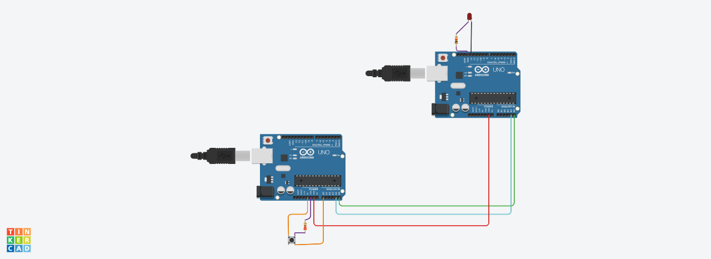

# Task2_IoT
## **Description**
In this task, we will connect two Arduino boards in series, and when we press the button on the first board, the light on the second board will turn on. 
## **Circuit**
In these circuit we use these components:
2 Arduino boards
2 Resistors 
1 Push button
1 LED
Normal wires

